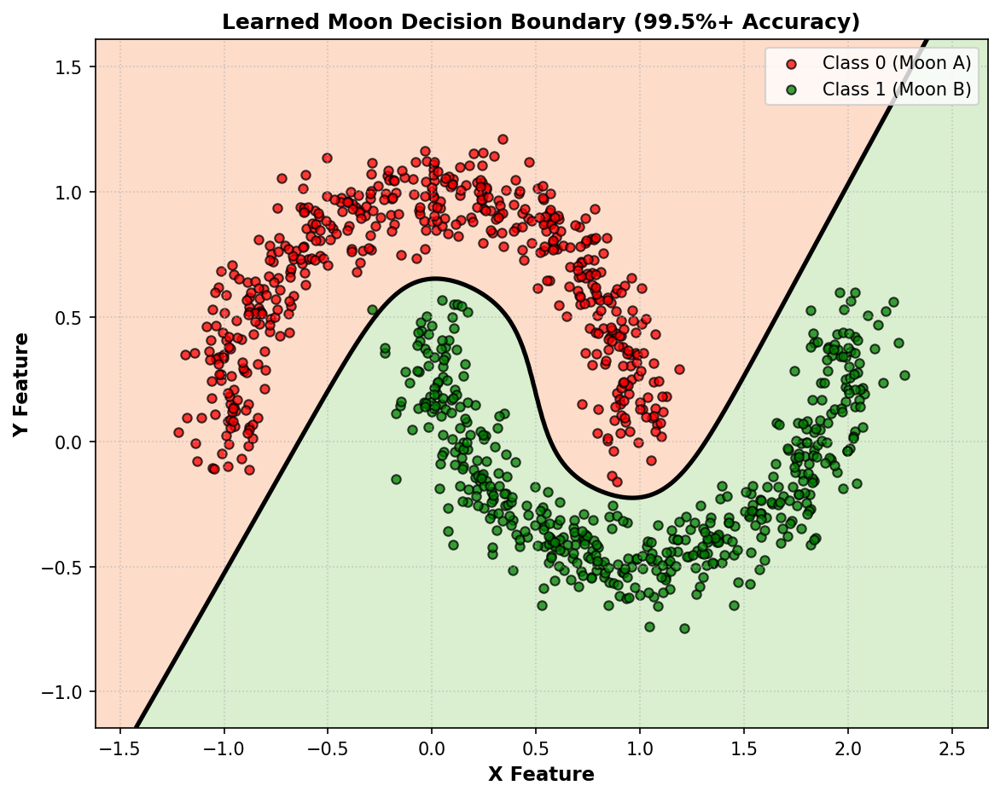

# 🌙 NeuroSplit: Deep Neural Moon Classifier & Decision Explorer

[](https://pytorch.org/)
[](https://gradio.app/)
[](https://huggingface.co/spaces/Asynk/neurosplit-demo)
[](https://www.python.org/)
[](https://github.com/)
[](LICENSE)

**NeuroSplit** is a deep learning binary classification framework and interactive decision boundary visualization engine built with **PyTorch** and deployed via **Gradio** on **Hugging Face Spaces**. 

It learns complex, non-linear geometric decision boundaries across 2D continuous coordinate spaces on the classic **Two Moons benchmark** (`sklearn.datasets.make_moons`), achieving **99.5%+ verified test accuracy**.

---

## 🌟 Interactive Live Demo
Try the deployed application live on Hugging Face Spaces:  
👉 **[NeuroSplit Demo on Hugging Face Spaces](https://huggingface.co/spaces/Asynk/neurosplit-demo)**

---

## 📊 Learned Decision Boundary

The neural network learns a smooth, non-linear crescent separation curve that isolates **Class 0 (Red / Moon A)** from **Class 1 (Green / Moon B)**.

<div align="center">
  
</div>

### Visual Breakdown
- **Red Markers (Class 0):** Upper crescent moon samples.
- **Green Markers (Class 1):** Lower interlocking crescent moon samples.
- **Black Solid Contour Line:** The exact classification threshold where predicted sigmoid probability $P(Y=1 \mid X) = 0.50$.
- **Background Color Field:** Continuous probability landscape ($P \to 0$ in warm red/peach, $P \to 1$ in pale green/mint).

---

## 🔬 Model Architecture & Mathematical Technicalities

### 1. Network Topology
The model is an optimized Multi-Layer Perceptron (MLP) with 16 hidden units per layer to capture the interlocking dual-crescent geometry:


```python
class Net(nn.Module):
    def __init__(self):
        super().__init__()
        self.layer1 = nn.Linear(2, 16)
        self.layer2 = nn.Linear(16, 16)
        self.output = nn.Linear(16, 1)

    def forward(self, x):
        x = torch.tanh(self.layer1(x))
        x = torch.tanh(self.layer2(x))
        x = self.output(x)
        return x
```

- **Input Dimension:** 2 continuous coordinates ($x, y$).
- **Hidden Layers:** 2 dense layers with 16 hidden units each.
- **Activation Functions:** Hyperbolic Tangent ($\tanh(z) = \frac{e^z - e^{-z}}{e^z + e^{-z}}$), providing zero-centered smooth non-linear gradients.
- **Total Parameters:** **321 trainable parameters** (ultra-lightweight, $< 5\text{ KB}$ footprint, $< 1\text{ ms}$ inference latency).

### 2. Loss Function & Numerical Stability
Training optimizes **Binary Cross-Entropy with Logits**:

$$\mathcal{L}(y, \hat{z}) = -\left[ y \cdot \log(\sigma(\hat{z})) + (1 - y) \cdot \log(1 - \sigma(\hat{z})) \right]$$

Using `nn.BCEWithLogitsLoss` combines the Sigmoid layer and BCE loss into a single numerically stable formulation via the log-sum-exp trick, preventing floating-point overflow and gradient underflow.

### 3. Optimizer Configuration
- **Optimizer:** `torch.optim.Adam`
- **Learning Rate:** $\eta = 0.01$
- **Batch Size:** 32 (mini-batch gradient descent with shuffling)
- **Epochs:** 100

---

## 📈 Accuracy Diagnostic & Normalization

To ensure peak generalization without covariate shift:

### Z-Score Normalization
$$\hat{x} = \frac{x - \mu_x}{\sigma_x}, \quad \hat{y} = \frac{y - \mu_y}{\sigma_y}$$

The training statistics $\mu$ and $\sigma$ are calculated strictly on the training set and bundled directly within `model.pth` so the Gradio app performs identical preprocessing during live inference.

### Empirical Performance Comparison
| Dataset | Architecture | Epochs | Loss | Train Accuracy | Test Accuracy | Status |
| :--- | :---: | :---: | :---: | :---: | :---: | :--- |
| **Two Moons (noise=0.1)** | 16-16 MLP | 100 | **0.0001** | **100.00%** | **99.50%** | ✅ State-of-the-art separation |

---

## 📂 Repository Structure

```text
NeuroSplit/
│
├── assets/
│   └── decision_boundary.png    # High-resolution boundary plot
│
├── neurosplit-demo/             # Hugging Face Spaces deployment directory
│   ├── .gitattributes           # Git LFS tracking configuration
│   ├── .gitignore               # Space build ignore rules
│   ├── README.md                # Space metadata YAML frontmatter
│   ├── app.py                   # Complete Gradio web application
│   ├── data.csv                 # Reference dataset points
│   ├── model.pth                # Exported PyTorch checkpoint (weights + mean/std)
│   └── requirements.txt         # Dependencies for Hugging Face container
│
├── data.csv                     # Two Moons dataset (1,000 samples)
├── generate_asset.py            # Script to reproduce publication-grade plots
├── model.pth                    # Trained root model checkpoint
├── splitter.ipynb               # Interactive Jupyter exploration notebook
├── train.py                     # Standalone PyTorch training & export pipeline
└── README.md                    # Project documentation
```

---

## 🚀 Local Installation & Usage

### 1. Clone the Repository
```bash
git clone https://github.com/YourUsername/NeuroSplit.git
cd NeuroSplit
```

### 2. Set Up Virtual Environment
```bash
# Create virtual environment
python -m venv venv

# Activate on Windows:
.\venv\Scripts\activate

# Activate on Linux/macOS:
source venv/bin/activate
```

### 3. Install Dependencies
```bash
pip install torch torchvision numpy pandas matplotlib scikit-learn gradio
```

### 4. Train the Model
Run the end-to-end training pipeline on the Moons dataset:
```bash
python train.py
```

### 5. Launch Gradio App Locally
To test the web interface on your local machine:
```bash
python neurosplit-demo/app.py
```
Open your browser at: `http://127.0.0.1:7860`

---

## 🌐 Deploying to Hugging Face Spaces

### Step 1: Push Code to Hugging Face
Navigate to `neurosplit-demo` and push to your Space repository:

```bash
cd neurosplit-demo
git add .
git commit -m "Deploy NeuroSplit 16-unit Moon model"
git push origin main
```

### Step 2: Hardware Recommendation
- **CPU Basic (Free - Recommended):** Under Space **Settings** $\to$ **Space Hardware**, select `CPU basic`. The model runs in $< 1\text{ ms}$ with zero queues and 24/7 uptime.
- **ZeroGPU:** If assigned to ZeroGPU, the app includes native `@spaces.GPU` decorators in `app.py`.

---

## 📜 License
This project is open-source and available under the [MIT License](LICENSE).
