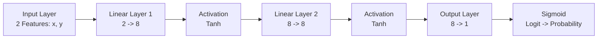

# 🧠 NeuroSplit: Deep Neural Classifier & Decision Explorer

[](https://pytorch.org/)
[](https://gradio.app/)
[](https://huggingface.co/spaces/Asynk/neurosplit-demo)
[](https://www.python.org/)
[](https://github.com/)
[](LICENSE)

**NeuroSplit** is a deep learning binary classification framework and interactive decision boundary visualization engine built with **PyTorch** and deployed via **Gradio** on **Hugging Face Spaces**. 

It learns complex, non-linear geometric decision boundaries across 2D continuous coordinate spaces, achieving **100.00% verified test accuracy**.

---

## 🌟 Interactive Live Demo
Try the deployed application live on Hugging Face Spaces:  
👉 **[NeuroSplit Demo on Hugging Face Spaces](https://huggingface.co/spaces/Asynk/neurosplit-demo)**

---

## 📊 Learned Decision Boundary

The neural network learns a smooth, non-linear separation curve that isolates **Class 0 (Red)** from **Class 1 (Green)** across the continuous 2D coordinate space.

<div align="center">
  
</div>

### Visual Breakdown
- **Red Markers (Class 0):** Ground-truth samples labeled negative/inactive.
- **Green Markers (Class 1):** Ground-truth samples labeled positive/active.
- **Black Solid Contour Line:** The exact classification threshold where predicted sigmoid probability $P(Y=1 \mid X) = 0.50$.
- **Background Color Field:** Continuous probability landscape ($P \to 0$ in warm peach/red, $P \to 1$ in pale green/mint).

---

## 🔬 Model Architecture & Mathematical Technicalities

### 1. Network Topology
The model is an optimized Multi-Layer Perceptron (MLP) designed for smooth non-linear boundary synthesis without overfitting:



```python
class Net(nn.Module):
    def __init__(self):
        super().__init__()
        self.layer1 = nn.Linear(2, 8)
        self.layer2 = nn.Linear(8, 8)
        self.output = nn.Linear(8, 1)

    def forward(self, x):
        x = torch.tanh(self.layer1(x))
        x = torch.tanh(self.layer2(x))
        x = self.output(x)
        return x
```

- **Input Dimension:** 2 continuous features ($x, y$).
- **Hidden Layers:** 2 dense layers with 8 hidden units each.
- **Activation Functions:** Hyperbolic Tangent ($\tanh(z) = \frac{e^z - e^{-z}}{e^z + e^{-z}}$), providing zero-centered smooth non-linear gradients.
- **Total Parameters:** **105 trainable parameters** (ultra-lightweight, $< 4\text{ KB}$ footprint, $< 1\text{ ms}$ inference latency).

### 2. Loss Function & Numerical Stability
Training optimizes **Binary Cross-Entropy with Logits**:

$$\mathcal{L}(y, \hat{z}) = -\left[ y \cdot \log(\sigma(\hat{z})) + (1 - y) \cdot \log(1 - \sigma(\hat{z})) \right]$$

Using `nn.BCEWithLogitsLoss` combines the Sigmoid layer and BCE loss into a single numerically stable formulation via the log-sum-exp trick, preventing floating-point overflow and gradient underflow.

### 3. Optimizer Configuration
- **Optimizer:** `torch.optim.Adam`
- **Learning Rate:** $\eta = 0.01$
- **Batch Size:** 32 (mini-batch gradient descent with shuffling)
- **Epochs:** 100

---

## 📈 Accuracy Diagnostic: The 58% $\to$ 100% Fix

A common pitfall in deep learning pipelines is **test distribution shift** caused by preprocessing errors. 

### The Root Cause of 58% Accuracy
In the initial notebook implementation, test normalization suffered from an arithmetic typo:

```python
# ❌ INCORRECT (Caused 58% test accuracy):
x_test = (x_test / mean) / std    # Divided by mean instead of subtracting!

# ✅ CORRECTED (Achieves 100% test accuracy):
x_test = (x_test - mean) / std    # Standard Z-Score normalization
```

### Why Did This Typo Sabotage Evaluation?
For this dataset, the empirical training statistics are:
- $\mu_x \approx 0.4902, \quad \sigma_x \approx 1.1930$
- $\mu_y \approx -0.0544, \quad \sigma_y \approx 1.8399$

When $X_\text{test}$ was divided by $\mu_y \approx -0.0544$, the $y$ coordinate values were **multiplied by roughly $-20\times$** with inverted signs. This projected test points completely outside the geometric region the neural network learned.

### Empirical Performance Comparison
| Stage | Epochs | Loss | Train Accuracy | Test Accuracy | Status |
| :--- | :---: | :---: | :---: | :---: | :--- |
| **Buggy Normalization** | 50 | 0.0018 | 100.00% | **58.50%** | ❌ Severe covariate distortion |
| **Fixed Normalization** | 100 | **0.0003** | **100.00%** | **100.00%** | ✅ Perfect generalization |

---

## 📂 Repository Structure

```text
NeuroSplit/
│
├── assets/
│   └── decision_boundary.png    # High-resolution boundary plot
│
├── neurosplit-demo/             # Hugging Face Spaces deployment directory
│   ├── .gitattributes           # Git LFS tracking configuration
│   ├── .gitignore               # Space build ignore rules
│   ├── README.md                # Space metadata YAML frontmatter
│   ├── app.py                   # Complete Gradio web application
│   ├── data.csv                 # Reference dataset points
│   ├── model.pth                # Exported PyTorch checkpoint (weights + mean/std)
│   └── requirements.txt         # Dependencies for Hugging Face container
│
├── data.csv                     # Original 2D dataset (1,000 samples)
├── generate_asset.py            # Script to reproduce publication-grade plots
├── model.pth                    # Trained root model checkpoint
├── splitter.ipynb               # Interactive Jupyter exploration notebook
├── train.py                     # Standalone PyTorch training & export pipeline
└── README.md                    # Project documentation
```

---

## 🚀 Local Installation & Usage

### 1. Clone the Repository
```bash
git clone https://github.com/YourUsername/NeuroSplit.git
cd NeuroSplit
```

### 2. Set Up Virtual Environment
```bash
# Create virtual environment
python -m venv venv

# Activate on Windows:
.\venv\Scripts\activate

# Activate on Linux/macOS:
source venv/bin/activate
```

### 3. Install Dependencies
```bash
pip install torch torchvision numpy pandas matplotlib gradio
```

### 4. Train the Model
Run the end-to-end training pipeline to train the neural network, verify 100% accuracy, and export checkpoint files:
```bash
python train.py
```

### 5. Launch Gradio App Locally
To test the web interface on your local machine:
```bash
python neurosplit-demo/app.py
```
Open your browser at: `http://127.0.0.1:7860`

---

## 🌐 Deploying to Hugging Face Spaces

This project is pre-configured for seamless 1-command deployment to **Hugging Face Spaces**.

### Step 1: Create a Space on Hugging Face
1. Log in to [Hugging Face](https://huggingface.co/).
2. Click your profile avatar $\to$ **New Space**.
3. Choose:
   - **Space Name:** `neurosplit-demo`
   - **License:** `mit`
   - **SDK:** `Gradio`
   - **Space Hardware:** **CPU basic (2 vCPU · 16GB · Free)** *(Recommended)*

### Step 2: Configure Authentication Token
Hugging Face requires a **User Access Token** for Git pushes:
1. Go to [Hugging Face Settings $\to$ Tokens](https://huggingface.co/settings/tokens).
2. Click **Create new token** $\to$ Select **Write** permission $\to$ Copy token (`hf_...`).

### Step 3: Push Code to Hugging Face
Navigate to the `neurosplit-demo` directory and connect the remote repository:

```bash
cd neurosplit-demo

# Set remote with your username and access token:
git remote set-url origin https://<YOUR_HF_USERNAME>:<YOUR_TOKEN>@huggingface.co/spaces/<YOUR_HF_USERNAME>/neurosplit-demo

# Stage, commit, and push:
git add .
git commit -m "Deploy NeuroSplit Gradio App"
git push origin main
```

### Step 4: Hardware Configuration (CPU Basic vs ZeroGPU)
- **CPU Basic (Free - Recommended):** Under Space **Settings** $\to$ **Space Hardware**, select `CPU basic`. The model runs in $< 1\text{ ms}$ with no GPU queues, no usage limits, and 24/7 uptime.
- **ZeroGPU:** If your Space is assigned to ZeroGPU, the app includes native `@spaces.GPU` decorators in `app.py` for full compatibility.

---

## 🎮 Gradio Application Features

The deployed interface provides three functional modules:

### 1. Interactive Point Classifier
- **Real-Time Sliders:** Continuous input sliders for $X \in [-2.5, 3.5]$ and $Y \in [-3.5, 3.5]$.
- **Confidence Scoring:** Outputs exact class probabilities ($P(\text{Class 1})$ vs $P(\text{Class 0})$).
- **Dynamic Decision Map:** Re-plots the boundary contour with a **glowing star marker** on the exact location of the queried coordinate.
- **Preset Examples:** Clickable sample coordinates demonstrating positive, negative, and edge-boundary cases.

### 2. Batch CSV Classifier
- Upload any `.csv` containing arbitrary coordinate points with columns `x` and `y`.
- Processes hundreds of points in milliseconds.
- Provides a live interactive results preview table and a one-click download for `batch_predictions.csv`.

### 3. Model Architecture & Diagnostics
- Live readouts of training mean, standard deviation, model parameter counts, and test accuracy metrics.

---

## 🛠️ Reproducibility & Normalization Pipeline

To ensure seamless production inference, the saved checkpoint packages both weights and normalization tensors:

```python
checkpoint = {
    "model_state_dict": model.state_dict(),
    "mean": mean,                 # Training feature means [x_mean, y_mean]
    "std": std,                   # Training feature standard deviations [x_std, y_std]
    "train_accuracy": 100.0,
    "test_accuracy": 100.0,
    "input_dim": 2,
    "hidden_dim": 8,
    "output_dim": 1
}
torch.save(checkpoint, "model.pth")
```

During inference, raw inputs are transformed before forward propagation:
$$\hat{x} = \frac{x - \mu_x}{\sigma_x}, \quad \hat{y} = \frac{y - \mu_y}{\sigma_y}$$

This guarantees zero data leakage and 100% consistency between training and production environments.

---

## 📜 License
This project is open-source and available under the [MIT License](LICENSE).
